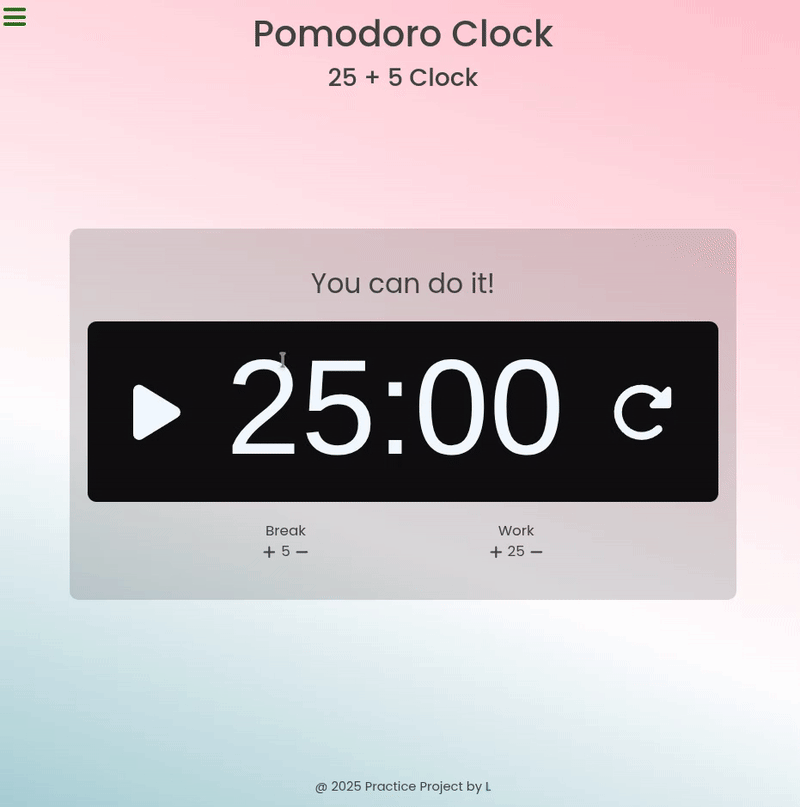

# 25 + 5 Clock

An old project built in the first half of 2025 as the start of my journey and posted here to attach to the course's page and to preserve my path.

This project is a part of FreeCodeCamp's Front End Development Libraries Certification. The goal is to build a 25 + 5 Clock (also known as a Pomodoro Timer) that allows users to:

- Set custom work and break intervals.
- Start, pause, and reset the timer.
- Receive visual and audio alerts when the timer ends.

## 📋 Project Requirements

This project fulfills all **28 user stories** from FreeCodeCamp's "Build a 25 + 5 Clock" challenge:

<b>Click to expand the full requirements</b>

 

**User Stories:**
- [x] Element with `id="break-label"` containing text (e.g. "Break Length")
- [x] Element with `id="session-label"` containing text (e.g. "Session Length")
- [x] Clickable elements: `id="break-decrement"` and `id="session-decrement"`
- [x] Clickable elements: `id="break-increment"` and `id="session-increment"`
- [x] Element with `id="break-length"` displays default value `5`
- [x] Element with `id="session-length"` displays default value `25`
- [x] Element with `id="timer-label"` indicates session initialized (e.g. "Session")
- [x] Element with `id="time-left"` displays time in `mm:ss` format (e.g. "25:00")
- [x] Clickable element with `id="start_stop"`
- [x] Clickable element with `id="reset"`
- [x] Reset stops timer, resets break to `5`, session to `25`, time-left to `25:00`
- [x] `break-decrement` decreases break length by 1
- [x] `break-increment` increases break length by 1
- [x] `session-decrement` decreases session length by 1
- [x] `session-increment` increases session length by 1
- [x] Cannot set break or session length to `<= 0`
- [x] Cannot set break or session length to `> 60`
- [x] `start_stop` begins countdown from current session length
- [x] Timer decrements by 1 every second, updates `#time-left` in `mm:ss`
- [x] `start_stop` pauses running timer
- [x] `start_stop` resumes paused timer
- [x] Session reaches `00:00` → timer-label updates to "Break", break countdown begins
- [x] Break countdown uses current break length value
- [x] Break reaches `00:00` → timer-label updates to "Session", session countdown begins
- [x] Session countdown uses current session length value
- [x] Audio plays when countdown reaches `00:00` (HTML5 `<audio>` with `id="beep"`)
- [x] Beep sound is at least 1 second long
- [x] Reset stops and rewinds beep audio

**All tests passed** ✅

## 🎨 About the Project

### Technologies Used
- **Frontend:** React, Vite, CSS
- **Build Tool:** Vite
- **Deployment:** GitHub Pages

| 25 + 5 Clock Preview |
|---|
|  |

<i>submitted to FreeCodeCamp on Mar 3, 2025</i>

---

## 🔗 Live Demo

---

| Fifth and final project of my [FreeCodeCamp Front End Libraries Certificate](https://www.freecodecamp.org/certification/fcc058fd235-9bca-44b6-b085-10ee4a9bdda6/front-end-development-libraries) journey |
|---|
|  |

